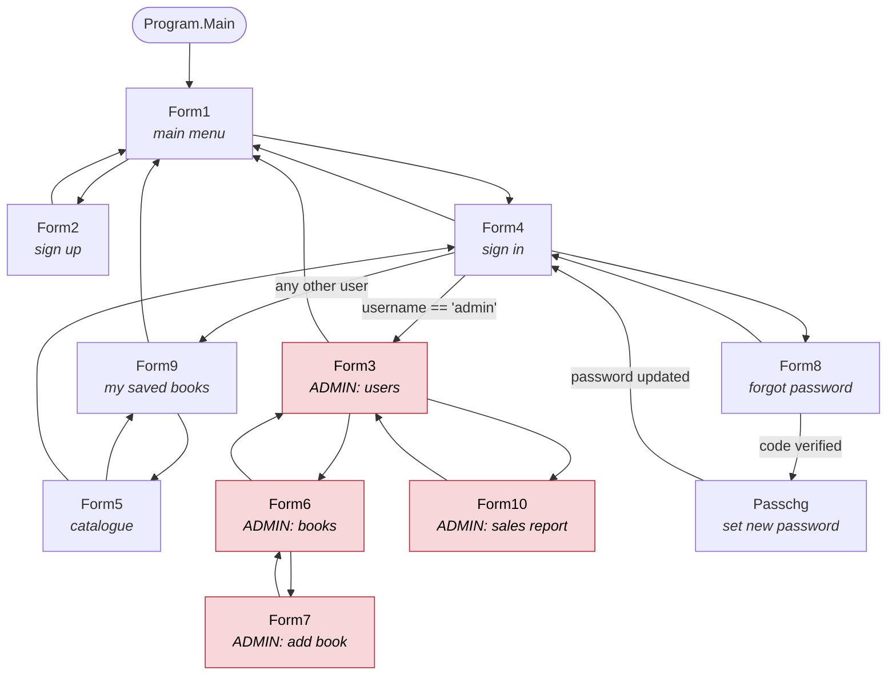

# Architecture

This describes the application **as it is**, not as it should be. Where the
current design causes problems that is called out rather than smoothed over.

## Shape of the system

There are three things: a WinForms UI, a set of "CRUD" classes, and LocalDB.
There is no service layer, no repository, no DTO boundary and no dependency
injection.

```
┌──────────────────────────────────────────────────────────────┐
│  UI          Form1 … Form10, Passchg                         │
│              button click handlers contain the flow logic    │
└───────┬──────────────────────────────────────────────────────┘
        │  passes ListView / DataGridView / TextBox / PictureBox
        │  instances straight down
┌───────▼──────────────────────────────────────────────────────┐
│  "CRUD"      DataBaseCrud, DbCrudBook, LabelValidator,        │
│              PasswordUpdator, Emailverifycs                  │
│              builds SQL, opens connections, and also calls    │
│              MessageBox.Show and mutates the controls         │
└───────┬──────────────────────────────────────────────────────┘
        │  Microsoft.Data.SqlClient
┌───────▼──────────────────────────────────────────────────────┐
│  Data        LocalDB — Stu1, Books, saver1                    │
└──────────────────────────────────────────────────────────────┘
```

A few recent additions sit slightly outside that picture and are the only real
seams in the codebase:

| Namespace | Type | Role |
| --- | --- | --- |
| `db.Configuration` | `AppSettings` | Resolves the connection string and the SMTP settings from `App.config`, then environment variables, then defaults. |
| `db.Security` | `PasswordHasher` | PBKDF2 hash/verify, and detection of legacy plaintext rows. |
| `db.Security` | `Session` | The signed-in user, and the `DenyIfNotAdmin()` guard the admin screens call on load. Process-wide static state — a deliberate stopgap, see step 7. |
| `db.Data` | `IAuthService` / `AuthService` | The one piece of data access with a meaningful interface in front of it. It returns an `AuthenticatedUser` record, not a control. |
| `db` | `Navigation` | `GoTo(current, next)` — the single place a window hands over to the next one, replacing the old hand-written `Hide()` + `new FormX().Show()` blocks that leaked hidden forms. |

`Locator.GetConnectionString()` is a static accessor that every class calls in
a field initialiser. It is a service-locator, not injection — the connection
string is effectively a global.

## Form navigation

Derived from the actual `new FormN()` / `Application.Run` calls in the source.
Every edge is a `Navigation.GoTo(this, new FormN(...))`: show the next form at
the current form's position and size, then close the current one.



`Form1.button3_Click_1` — the "edit" button — used to open the admin user
manager directly, with no sign-in at all. It now goes to `Form4`, and the three
admin screens (`Form3`, `Form6`, `Form10`) additionally check `Session.IsAdmin`
on load, so reaching them by any other route bounces back to sign-in.

There is also an implicit data path the diagram cannot show. `Form4` reads the
username from the login box and threads it, plus the avatar bytes, through
`Form9(string ids, byte[] images)` → `Form5(string ids, byte[] images)` →
`new DbCrudBook(ids)`. That string is the session — it is the only notion of
"who is signed in" that exists.

## What the coupling actually looks like

### 1. The data layer takes WinForms controls

```csharp
public void selector(ListView listView1)
public void selector(DataGridView dataGridView1, Form form)
public void update(DataGridView dataGridView1, int index, TextBox textBox1, …)
public bool updator(TextBox newPassword, TextBox confirmPassword)
public void selectoring(string email, string username, TextBox text_email, TextBox text_user)
```

Consequences:

- Nothing can be unit tested. Every method needs a live control, and several
  need a live `Form`.
- The data layer decides what the user sees. `DataBaseCrud.delete` calls
  `MessageBox.Show`; `LabelValidator.selectoring` clears the caller's textbox.
- Queries and presentation are welded together — `selector(ListView)` does
  `SELECT *` and then hard-codes nine `SubItems` in a fixed order, so the
  column order is an undeclared cross-file contract: `Form3` reads
  `SubItems[4]` for the birth date and `SubItems[8]` for the username. The
  password sub-item deliberately carries `DataBaseCrud.MaskedPassword`
  (`"********"`) rather than the stored hash, which means `SubItems[7]` is a
  display value that must never be written back.

### 2. The data layer knows about specific forms

```csharp
if (form is Form5)
{
    dataGridView1.Columns.Insert(0, chk);
}
```

`DataBaseCrud.selector` branches on the concrete type of its caller to decide
whether to add a "select" checkbox column. Adding a second screen that needs
checkboxes means editing the data layer.

### 3. Navigation still leaks into the helper classes

`Navigation.GoTo` centralised the *mechanics*, but not the *decision*.
`PasswordUpdator`'s constructor still takes a `Form` it never uses, and
`Emailverifycs.adapt(TextBox textbox1, Form form, Form this_form)` still takes
the destination and source forms and shows one of them. Both signatures are
kept because call sites depend on them, not because they make sense.

### 4. The signed-in user is a bare string

There is no session type. `Form4` gets an `AuthenticatedUser` back from
`AuthService`, immediately discards everything except `UserName` and `Photo`,
and threads those two values through constructors:

```
Form4  →  Form9(string ids, byte[] images)
       →  Form5(string ids, byte[] images)
       →  new DbCrudBook(ids)
```

`DbCrudBook`'s parameter is named `id` and its XML doc says it is `Stu1.Id`,
but every caller passes a username, and that is what lands in `saver1.iduser`.
Administrator-ness is likewise not carried anywhere: it is recomputed as
`username == "admin"`.

### 5. Connection strings are fetched, not injected

Most classes still do `string connection = Locator.GetConnectionString();` in a
field initialiser (`LabelValidator` even exposes it as a public field).
`DataBaseCrud` and `DbCrudBook` now honour a constructor-supplied string and
fall back to `AppSettings.ConnectionString`, which is the right shape — but
nothing composes them, so in practice every screen constructs its own.

### 6. Two namespaces, one project

`Program`, `Form1`, `Form2`, `Form3` and `CommonFieldValidatorFunctions` live
in `WinFormsApp3`; everything else lives in `db`. Files in each namespace need
a `using` for the other. `db.Regex` also shadows
`System.Text.RegularExpressions.Regex` inside `db`.

### 7. Types are stringly

`Book.price` and `Book.Date` are `string`, and the columns behind them are
`NVARCHAR`. Dates are persisted with `DateTime.ToString()` (culture-dependent)
by `Form2` and `Form7`, and with `ToString("yyyy-MM-dd")` by `Form3` — same
column, two formats. Prices are compared as strings in
`DbCrudBook.inserter`'s duplicate check, so `'5'` and `'5.00'` are different
books, and they are parsed back with a lenient `decimal.TryParse` that returns
`0` on failure, so a malformed price is silently free. See the `-- TODO:` notes
in [`../sql/schema.sql`](../sql/schema.sql).

## Refactors that would fix this

In dependency order — each step is useful on its own.

1. **Extract row models.** Add `UserRow` and `BookRow` records mirroring the
   `Stu1` and `Books` columns. `Book` and `IUser` are nearly this already; give
   them real types (`decimal Price`, `DateOnly Date`, `int Quantity`).

2. **Give the data layer a control-free API.** Replace
   `selector(ListView)` with `IReadOnlyList<UserRow> GetUsers()`, `update(ListView, …)`
   with `void Update(UserRow user)`, `delete(ListView)` with
   `void Delete(int id)`, and so on. Move the `ListView`/`DataGridView`
   population into the forms, next to the columns being populated.

3. **Remove `MessageBox.Show` from everything below the UI.** Data methods
   should return a result or throw; the form decides what to say. This is the
   change that makes the layer testable.

4. **Define `IUserRepository`, `IBookRepository`, `IBasketRepository`** over
   the methods from step 2, following the shape `IAuthService` already
   establishes. Take the connection string as a constructor argument and delete
   the `Locator` field initialisers.

5. **Finish the navigation seam.** `Navigation.GoTo` already owns the
   mechanics; the remaining work is to stop passing `Form` instances into
   non-UI classes — `PasswordUpdator(string, Form)` and
   `Emailverifycs.adapt(TextBox, Form, Form)` — so those classes just report a
   result and the form decides where to go.

6. **Introduce a session object.** Replace the `(string username, byte[] avatar)`
   pair threaded through constructors with a `CurrentUser` carrying `Id`,
   `UserName` and `IsAdmin`. That in turn lets `saver1.iduser` become a real
   foreign key.

7. **Replace the static `Session`** with that threaded identity. The admin
   screens are already gated on `Session.IsAdmin` and the direct
   `Form1 → Form3` link is gone, but the session itself is process-wide static
   state, which is a stopgap rather than a design.

8. **Keep the SQL honest.** The interpolated queries have been parameterised;
   `dotnet_diagnostic.CA2100` is set to `warning` in `.editorconfig` so a
   regression shows up in the build log rather than in a review.

9. **Collapse `WinFormsApp3` into `db`.** Cheap once nothing else is in flight,
   and it removes a whole class of "which `Regex`?" confusion.

10. **Then add tests.** After step 3 the repositories can be exercised against
    a LocalDB created from `sql/schema.sql`, and `PasswordHasher`,
    `LabelValidator.Validate` and the regex patterns are already pure enough to
    test today.
